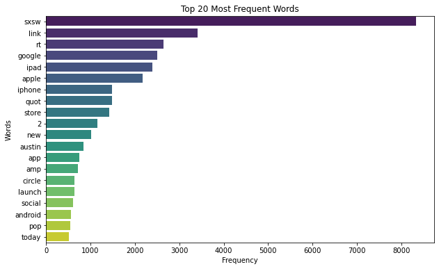
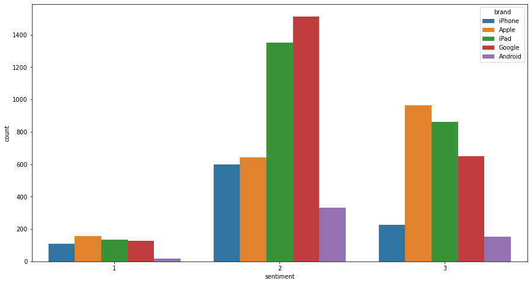
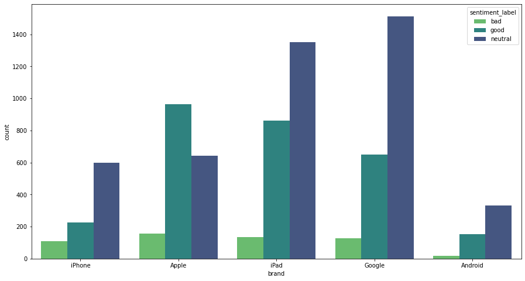
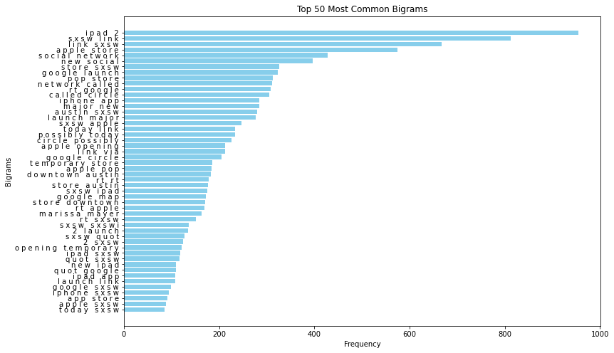

# NLP-Sentiment-Classification
### Will Byrd
### Flatiron School 2024

## Introduction

This is a multi-classification NLP project.  Tweets from 2011 regarding the South by Southwest (SXSW) tech and arts conference are preprocessed and and analyzed to create ML models that can predict sentiment.  I will create a variety of models and iteratively improve upon them-finally using ensemble methods to optimize the predictions.

## Business Understanding

We have downloaded a dataset that contains over 8000 tweets.  Tweets have been reviewed by humans to determine if the sentiment is negative, indifferent, positive, or if the human judge could not tell.  Some of the tweets have also been attributed to be about specific brands like Apple, Google, or Android.  Our dataset is from CrowdFlower via [data.world](https://data.world/crowdflower/brands-and-product-emotions).   
  
We have 2 main goals here.  The first is to **understand overall public opinion of specific brands and products at the SXSW conference** and the second is to **demonstrate proper NLP preprocessing techniques.**
  
## EDA
First thing we notice is an overwhelming amount of NaN values.  We use imputation and mapping to double the amount of tweets attributed to specific brands and then consolidate the amount of brands to :  
* iPhone  
* iPad  
* Apple  
* Google  
* Android  

Before we can really do any analysis or modelling, the data must be preprocessed.  We use the following steps in this notebook:

* Regex
* Lemmatization
* Stemming
* Removing Stopwords
* Removing nonword characters  

Next step is to use LabelEncoder for our categorical variable **'sentiment'**.  The rows where sentiment was unknown have been dropped since all NaN values will need to be removed prior to modelling.  We can take advantage of the ordinal nature of this column making:  

* Negative = 1
* Nuetral = 2
* Positive = 3  

Then **OneHotEncoding** is used for all of the brands mentioned above.  Now we can focus on the tweets again.  We will tokenize the tweets so that we can then vectorize them, creating a bag of words for our corpus.  These 2 steps will allow us to view frequency of words in our corpus, create TF-IDF Histograms, and view bigrams and trigrams.  

Another important step is to perform Part of Speech tagging.  POS tagging is important to understand grammar and context of words and also helps improve modelling.

## Modelling

Now that our data is cleaned and preprocessed for modelling, we begin to build the following models:

* Logistic Regression
* Decision Tree
* K-Nearest Neighbors
* Gradient Boosting

Each model will be improved upon using GridSearchCV which will find the best parameters for us.  We will then take the best models and use **Stacking and Voting Ensemble methods** to create even better models.

## Conclusion

## Recomendation
based on our models and analysis, it is clear that all things Apple were the most popular at this years SXSW conference.  Apple occured so much more frequently throughout our tweets that we were even able to break down the brand into 2 of the most popular items from that brand (iPhone, iPad).  We can also tell that iPad 2 is so commonly occuring in this dataset, that this conference was in 2011.

From a business perspective, I would encourage event organizers to give more allownaces and resources to Apple as they are clearly a main draw to this conference.  The next most popular brand would be Google.  Noted by rollout of the chromebook.

